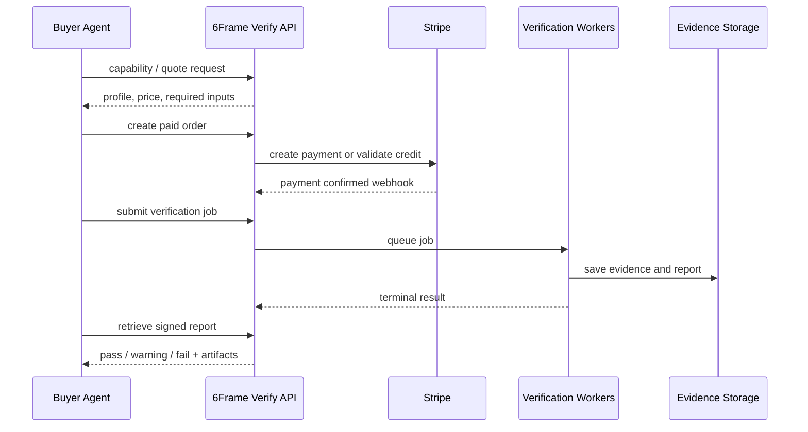
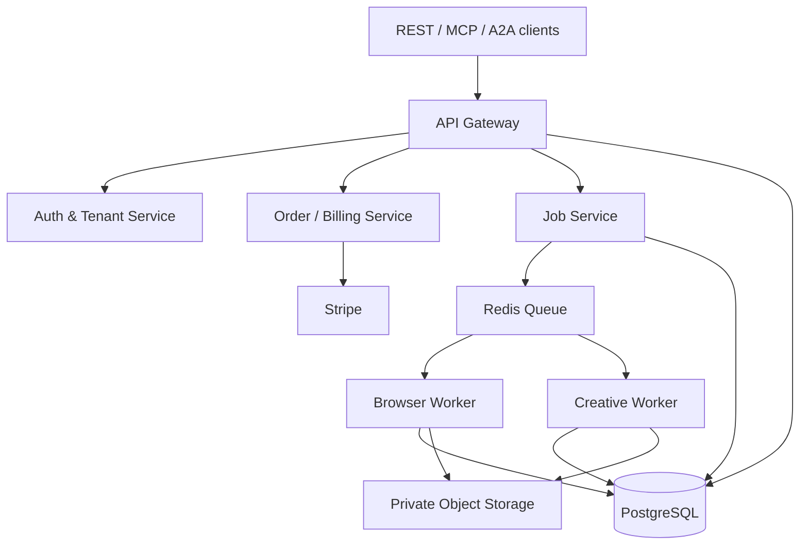

# 6Frame Verify — Product Design Requirements (PDR)

**Document status:** build-ready v1.0  
**Product type:** autonomous, paid agent-to-agent acceptance-testing service  
**Owner:** 6Frame Studio  
**Build intent:** a real production service. No simulated Stripe events, fake browser checks, mock results, or placeholder payment logic in production.

---

## 1. Executive decision

Build **6Frame Verify**, a machine-to-machine quality-control service that another AI agent calls immediately before it delivers a website, creative package, research result, or video-generation prompt package.

The service receives the buyer agent's original brief, the finished deliverable, and a test profile. It returns a signed, evidence-backed acceptance report: **pass**, **pass with warnings**, **fail**, or **cannot evaluate**. The report names every failed requirement, attaches proof, and provides deterministic repair instructions. It is a paid API service, not a human consulting business.

### The one-sentence product

> An AI agent pays 6Frame Verify to prove that its work actually meets the job before it says “done.”

### The operating constraint

The system must run without Bret having sales calls, discovery interviews, manual job fulfillment, or routine customer support. Bret is the account owner and product operator; buyers are software agents acting within payment authority previously granted by their users or organizations.

### V1 commercial wedge

Launch V1 with two test profiles:

1. **Website Acceptance** — verifies a deployed web experience against a structured brief.
2. **Creative / AI Film Continuity Acceptance** — verifies image, video, and prompt packages against locked character, wardrobe, prop, location, and shot rules.

The shared engine is the business. More profiles can be added without redesigning billing, discovery, tasking, evidence, or trust.

---

## 2. Product goals, non-goals, and success conditions

### Goals

| Goal | Product requirement |
|---|---|
| Zero-touch purchase | An authenticated buyer agent can discover capability, receive a quote, pay, submit, poll, and retrieve an artifact without human messaging. |
| Evidence, not vibes | Every scored assertion must link to a source, a browser trace, a screenshot, supplied asset, or an explicit `not_evaluable` reason. |
| Safe quality gate | The verifier has read-only access to customer URLs/files and never publishes, changes, emails, deploys, spends, or submits forms beyond a controlled test mode. |
| Repeatable economics | Each completed run is metered, paid before execution or covered by prepaid credit, and associated with a verifiable payment record. |
| Interoperability | The same service is callable through REST first, then MCP and A2A; it is not tied to one model vendor or agent framework. |
| Human-free operation | Automatic retries, refunds for platform-caused failures, support artifacts, monitoring, and abuse controls are built in. |

### Non-goals for V1

- No marketplace of third-party sellers.
- No autonomous code repair or publishing changes to a buyer’s property.
- No legal, accessibility, security, compliance, copyright, or trademark certification.
- No scraping behind authentication, paywalls, CAPTCHAs, or anti-bot controls.
- No direct access to buyer credentials, Stripe secret keys, or raw payment-card data.
- No claim that a creative output is “good”; the system only tests explicit requirements and declared quality criteria.
- No attempt to replace a full enterprise observability platform.

### Measurable launch targets

| Metric | Target before public launch | First 90 days |
|---|---:|---:|
| Validated paid run success rate | >= 98% | >= 99% |
| Median website report completion | <= 6 minutes | <= 4 minutes |
| False “pass” rate in internal evaluation set | < 3% | < 2% |
| All terminal reports include evidence or `not_evaluable` | 100% | 100% |
| Duplicate-payment rate | 0 | 0 |
| Browser isolation escape | 0 | 0 |
| Chargeback/refund rate | < 2% | < 1% |

---

## 3. Users and jobs to be done

### Primary buyer: delivery agent

An agent that has produced work for its own user/client and needs confidence before delivery.

**Job:** “Before I claim this is finished, tell me whether it meets the requirements and give me proof of every failure.”

### Secondary buyer: orchestrator agent

An agent that assigns work to multiple sub-agents and needs a neutral acceptance gate before releasing a next step, reputation score, or payment.

**Job:** “Evaluate this subcontractor output against the task contract and return a machine-readable release decision.”

### Product owner: Bret / 6Frame admin

**Job:** “Connect Stripe, set prices and allowed domains, observe live runs and revenue, review edge-case failures, and change policies without operating jobs manually.”

---

## 4. Core product workflow



### Canonical state machines

**Order:** `draft -> payment_pending -> paid -> credit_reserved -> consumed | refunded | expired | disputed`

**Job:** `created -> validating_input -> queued -> running -> awaiting_artifact? -> completed | completed_with_warnings | failed_platform | rejected_policy | cancelled | expired`

**Finding:** `pending -> pass | fail | warning | not_evaluable | skipped`

No state transition may depend solely on a browser client. The server owns all transitions.

---

## 5. V1 test profiles

### 5.1 Website Acceptance Profile

**Required input**

- `brief`: plaintext or structured requirement contract.
- `target_url`: publicly reachable HTTPS URL.
- `required_paths`: optional page paths.
- `viewport_matrix`: defaults to desktop 1440x900 and mobile 390x844.
- `brand_rules`: optional colors, logo, forbidden wording, approved claims, CTA rules.
- `test_mode`: `read_only` by default; form submission only when a provided test endpoint and test data are explicitly declared.

**V1 checks**

| Area | Checks |
|---|---|
| Availability | HTTPS, final destination, status code, timeout, console errors, asset failures |
| Requirements | Required pages/sections/CTA labels/claims/terms present or absent exactly as contract states |
| Interaction | Links resolve; visible buttons are actionable; navigation opens; defined test forms validate/submit safely |
| Responsive | Screenshot and DOM capture at each viewport; overflow, hidden critical content, overlap, and unreadable text checks |
| Brand | Logo presence, dominant-color proximity, font family where declared, disallowed terms, approved name and CTA compliance |
| SEO basics | title, description, canonical, robots, Open Graph image/title, H1 count and presence |
| Evidence | URL, DOM selector/text, screenshot, HTTP/browser trace, exact requirement ID |

**Explicit limits:** Do not certify WCAG, penetration-test the site, bypass login, or interact with payments.

### 5.2 Creative / AI Film Continuity Profile

**Required input**

- `creative_bible`: locked characters, wardrobe, props, locations, visual rules, aspect ratio, and prohibited changes.
- `shots`: ordered shots with prompt, reference assets, optional generated frame/video URLs, and intended action.
- `output_type`: `prompt_package`, `image_sequence`, or `video_sequence`.

**V1 checks**

| Area | Checks |
|---|---|
| Identity | Character count, attributes, hair/color, age band, wardrobe, accessories, visible arms/hat rules when declared |
| Continuity | Props, costume, location, time-of-day, eyeline, screen direction, required objects and prohibited objects across shot sequence |
| Prompt contract | Required terms, exclusions, duration, aspect ratio, camera action, dialogue rules, model-specific fields |
| Technical | File type, duration, resolution, aspect ratio, frame sampling, duplicate/blank/corrupt media detection |
| Report | Frame/shot references, warning severity, diff explanation, corrected prompt clause—not regenerated media |

**Explicit limits:** It does not guarantee actor likeness rights, copyright ownership, factual realism, or final audience taste.

### 5.3 Test profile contract

Every profile is versioned JSON. A job always records `profile_id` and immutable `profile_version`. Existing reports must remain reproducible under the version that produced them.

---

## 6. Front-end product requirements

The public revenue path is machine-to-machine. The web front end exists for Bret’s admin use, transparent service documentation, and human fallback—not for sales conversations.

### 6.1 Public surface

| Route | Function |
|---|---|
| `/` | Product statement, live status, supported profiles, machine endpoints, pricing, security posture |
| `/docs` | OpenAPI reference, quickstart, request/response examples, limits, version changelog |
| `/.well-known/agent-card.json` | A2A discovery card |
| `/.well-known/openapi.json` | Machine-readable REST specification |
| `/mcp` | MCP Streamable HTTP endpoint, not a marketing page |
| `/status` | Public system status and incident history |
| `/pricing` | Fixed profile pricing, prepaid credit, documented refund logic |
| `/terms`, `/privacy`, `/acceptable-use` | Required policy documents |

### 6.2 Admin dashboard

Use a private authenticated application under `/app`.

| Screen | Required functions |
|---|---|
| Overview | Gross revenue, net revenue, Stripe payout status, paid runs, failure rate, queue depth, current incidents |
| Runs | Filter/search jobs, inspect timeline, download report/evidence, retry eligible platform failures, issue refund within policy |
| Profiles | Enable/disable profiles, choose published versions, edit price configuration, set concurrency/limits |
| Billing | Stripe connection status, products/prices, webhook health, disputes/refunds, payout-link to Stripe Dashboard |
| API access | Create/revoke service keys, scopes, IP restrictions, rate limits, usage history |
| Policy | Domain allow/deny rules, file-size limits, prohibited categories, retention controls, abuse review queue |
| Evaluations | Internal gold-set results, model prompt/version comparison, false-pass/false-fail review queue |
| System | Worker health, queue age, storage use, model-provider availability, audit-log viewer |

### 6.3 Design requirements

- Dark, editorial 6Frame visual system; clear operational data hierarchy over decorative effects.
- Every run must show: status, buyer tenant, paid order, profile/version, cost, timestamps, result, and evidence count.
- No dashboard action may silently delete evidence, payment records, audit logs, or a profile version.
- Use responsive desktop-first design; admin UI must remain usable on mobile for revenue/status monitoring.
- Accessibility baseline: keyboard navigation, visible focus, semantic labels, color is never the only state indicator.

---

## 7. Reference architecture

### 7.1 Recommended production stack

| Layer | Choice | Reason |
|---|---|---|
| Web/admin/API gateway | Next.js + TypeScript deployed on Vercel | Fast public/API delivery and secure admin UI |
| Database | PostgreSQL via Supabase | Durable relational records, row-level tenancy controls, backups |
| Object storage | Supabase Storage or S3-compatible private bucket | Private evidence, presigned download URLs, lifecycle retention |
| Background work | Railway worker service running Node/TypeScript | Long-running browser/media jobs must not depend on short serverless execution |
| Queue/cache | Redis via Upstash | Job queues, rate limits, idempotency locks, short-lived signed-report cache |
| Browser executor | Isolated Playwright Chromium workers | Real browser evidence and deterministic test behavior |
| AI provider layer | Provider adapter; xAI default plus OpenAI-compatible fallback | Avoid model lock-in; structured-output contract stays stable |
| Payments | Stripe account owned by 6Frame | Customer/payment records, payment confirmation, refunds, payouts |
| Agent discovery | A2A Agent Card + REST OpenAPI + MCP server | Cross-framework discovery and tool use |
| Observability | OpenTelemetry + Sentry + structured logs | Trace a run across API, payment, queue, worker, model, and storage |

### 7.2 Required services



### 7.3 Hard separation

- Web/API process cannot run arbitrary browser jobs.
- Browser workers run in isolated containers with ephemeral filesystems, blocked private-network access, strict outbound egress policy, and a per-job timeout.
- Worker processes receive only a job-scoped signed input manifest and write only to job-scoped storage paths.
- Stripe webhook endpoint is a separate route with raw-body signature verification before any database transition.
- Admin credentials, Stripe secret key, model keys, and storage credentials are server-side secrets only; never expose them to browser/client bundles.

---

## 8. Data model

Use PostgreSQL migrations. All IDs are UUIDv7. Store all timestamps in UTC. Soft-delete only non-financial user-facing configuration; never hard-delete financial/audit records before policy retention expires.

### 8.1 Core tables

| Table | Required fields |
|---|---|
| `tenants` | id, name, type (`admin`, `buyer`), status, created_at |
| `api_clients` | id, tenant_id, name, key_prefix, key_hash, scopes, rate_limit, expires_at, revoked_at |
| `profiles` | id, slug, current_published_version_id, enabled |
| `profile_versions` | id, profile_id, version, JSON schema, pricing config, evaluator config, published_at, retired_at |
| `quotes` | id, tenant_id, profile_version_id, normalized_input_hash, quote_amount, currency, expires_at, status |
| `orders` | id, tenant_id, quote_id, stripe_payment_intent_id, stripe_checkout_session_id, amount, currency, status, paid_at, refunded_at |
| `credit_ledgers` | id, tenant_id, order_id, delta, reason, balance_after, idempotency_key, created_at |
| `jobs` | id, tenant_id, order_id, profile_version_id, input_manifest_uri, input_hash, status, priority, attempt_count, deadline_at, started_at, finished_at |
| `job_steps` | id, job_id, step_name, status, started_at, finished_at, worker_version, error_code, trace_id |
| `requirements` | id, job_id, external_key, text, type, severity, source, normalized_rule JSONB |
| `findings` | id, job_id, requirement_id, verdict, severity, confidence, rationale, evidence_count, evaluator_version |
| `evidence_items` | id, job_id, finding_id, type, uri, content_hash, capture_metadata JSONB, created_at |
| `reports` | id, job_id, report_version, status, score, JSON artifact URI, HTML URI, signature, generated_at |
| `webhook_events` | id, provider, provider_event_id UNIQUE, payload_hash, received_at, processed_at, processing_status |
| `audit_events` | id, tenant_id, actor_type, actor_id, action, object_type, object_id, metadata JSONB, created_at |
| `model_runs` | id, job_id, provider, model, prompt_version, input_hash, output_hash, token_count, cost, latency_ms, safety_status |
| `domain_policies` | id, tenant_id nullable, pattern, mode, reason, created_at |

### 8.2 Database rules

- Enforce tenant filtering with row-level security for buyer-facing data.
- `stripe_payment_intent_id`, `stripe_checkout_session_id`, and external webhook event IDs are unique when non-null.
- A job can enter `queued` only when its associated order is `paid` or an atomic credit reservation succeeds.
- A completed report is immutable; corrections create `report_version + 1` with a linked reason.
- Store hashes for all input manifests, evidence items, and final report JSON for tamper detection.

---

## 9. API requirements

### 9.1 API conventions

- Base URL: `https://api.6frameverify.com/v1`.
- JSON only; UTF-8; TLS required.
- Auth: `Authorization: Bearer fv_live_<token>` for REST. Tokens are salted/hashed at rest.
- Every write endpoint requires `Idempotency-Key` header. Replays return the original response.
- All errors use `{ "error": { "code", "message", "request_id", "retryable", "details" } }`.
- All responses include `X-Request-Id` and current API version.
- Use signed URLs for report/evidence downloads; never proxy private binary files through the public API.
- Public rate limits: 60 requests/minute/client; job-creation limits depend on paid plan and worker capacity.

### 9.2 Required REST endpoints

| Method | Path | Function |
|---|---|---|
| GET | `/capabilities` | Profiles, versions, schemas, price rules, limits, supported transports |
| GET | `/profiles/{slug}` | Detailed profile contract and sample request/result |
| POST | `/quotes` | Validate input enough to quote deterministic price; returns expiring quote |
| POST | `/orders` | Create Stripe-backed order from quote or reserve prepaid credit |
| POST | `/orders/{id}/payment-session` | Return Stripe Checkout/agentic checkout details when applicable |
| GET | `/orders/{id}` | Payment state; never treat browser redirect as payment proof |
| POST | `/jobs` | Create job from a paid/reserved order |
| GET | `/jobs/{id}` | Current job state and progress; no evidence before terminal/authorized partial state |
| POST | `/jobs/{id}/cancel` | Cancel only before worker starts; reverse/reserve credit per policy |
| GET | `/jobs/{id}/report` | Signed report metadata / presigned URLs after terminal state |
| GET | `/jobs/{id}/evidence` | Paginated evidence descriptors; URLs require scoped signature |
| POST | `/webhooks/stripe` | Stripe event receiver; raw body signature verification |
| GET | `/healthz` | Liveness only |
| GET | `/readyz` | Dependency readiness; internal only or authenticated |

### 9.3 Example job creation request

```json
{
  "order_id": "ord_01J...",
  "profile": { "slug": "website-acceptance", "version": "1.0.0" },
  "callback": {
    "url": "https://buyer-agent.example/webhooks/verify",
    "secret_ref": "buyer-managed-shared-secret"
  },
  "input": {
    "brief": "Build a dark luxury homepage for 6Frame Studio. The hero must contain ...",
    "target_url": "https://preview.example.com",
    "required_paths": ["/", "/work", "/about"],
    "brand_rules": {
      "required_terms": ["6Frame Studio"],
      "forbidden_terms": ["revolutionary", "best-in-class"],
      "required_ctas": ["View the Work"]
    },
    "test_mode": "read_only"
  }
}
```

### 9.4 Example terminal report contract

```json
{
  "job_id": "job_01J...",
  "status": "completed_with_warnings",
  "release_decision": "pass_with_warnings",
  "score": 91,
  "profile_version": "website-acceptance@1.0.0",
  "summary": { "pass": 18, "warning": 2, "fail": 0, "not_evaluable": 1 },
  "findings": [
    {
      "requirement_id": "cta-001",
      "verdict": "warning",
      "severity": "medium",
      "reason": "CTA exists but opens a new tab without rel=noopener.",
      "repair": "Add rel=\"noopener noreferrer\" to the external target.",
      "evidence_ids": ["ev_01J..."]
    }
  ],
  "artifact": { "report_url": "signed URL", "expires_at": "..." },
  "integrity": { "input_hash": "sha256:...", "report_hash": "sha256:...", "signature": "..." }
}
```

### 9.5 Webhook contract to buyer agents

- Send only on terminal state or explicitly requested milestones.
- Sign every payload with `HMAC-SHA256` using the callback secret supplied at job creation.
- Retry with exponential backoff for 24 hours on retryable non-2xx responses.
- Include event ID and delivery attempt. Buyer must handle delivery idempotently.
- Events: `job.completed`, `job.completed_with_warnings`, `job.failed_platform`, `job.rejected_policy`, `job.cancelled`.

---

## 10. Agent-native interfaces

### 10.1 A2A interface

Publish a signed Agent Card at `/.well-known/agent-card.json`. A2A Agent Cards describe an agent’s identity, skills, endpoint, and authentication requirements; use the current specification and signed cards in production. 

**A2A skills to publish:**

- `quote_acceptance_test`
- `run_website_acceptance_test`
- `run_creative_continuity_test`
- `get_acceptance_report`

Task artifacts must be the same report JSON and evidence descriptors produced by REST. A2A is a transport adapter; it must not create a separate evaluation engine or data model.

### 10.2 MCP interface

Offer a protected Streamable HTTP MCP endpoint at `/mcp`.

**Tools:**

| Tool | Input | Output |
|---|---|---|
| `verify_get_capabilities` | none | profiles, price/rate limits |
| `verify_quote` | profile + draft manifest | validated quote or input errors |
| `verify_create_order` | quote ID + payment preference | order and payment action |
| `verify_submit_job` | paid order + manifest | job ID |
| `verify_get_job` | job ID | status/progress |
| `verify_get_report` | job ID | final structured report |

MCP authorization must use OAuth 2.1 / protected-resource metadata and minimum scopes. No unauthenticated tool may start a paid job or retrieve another tenant’s artifact.

### 10.3 OpenAPI and SDKs

- Publish OpenAPI 3.1 document from source, tested in CI.
- Generate TypeScript and Python SDKs from that document.
- Include CLI package `6frame-verify` with commands: `capabilities`, `quote`, `buy`, `submit`, `watch`, `report`.
- CLI must use environment variable `SIXFRAME_VERIFY_API_KEY`; never accept a Stripe secret key.

---

## 11. Payments and revenue system

### 11.1 Stripe is the system of record for money

Connect the 6Frame Stripe account directly. No Stripe Connect is required in V1 because 6Frame is the only seller. Use Connect only if the product later becomes a multi-seller marketplace.

### 11.2 Payment modes

| Mode | Buyer behavior | V1 status |
|---|---|---|
| Prepaid API credits | Buyer account buys a fixed credit pack using Stripe Checkout; jobs reserve/consume credit | Required |
| Per-job PaymentIntent / Checkout | Buyer agent creates an order, completes standard or agentic payment, then submits job | Required |
| Stripe Agentic Commerce / shared payment token | Buyer agent provides a scoped payment credential under Stripe’s agentic-commerce flow | Implement behind feature flag after Stripe account eligibility/testing |
| x402 stablecoin micro-payment | Buyer receives 402, pays, retries request | Phase 2; separate ledger and settlement policy |

### 11.3 Stripe implementation requirements

- Create Stripe Products and Prices for each credit pack and subscription/volume tier in live mode.
- Use one PaymentIntent per order/session and set an idempotency key based on internal `order_id`.
- Treat only a verified Stripe webhook such as successful checkout/payment event as proof of payment. Never unlock a job because a buyer reaches a success URL.
- Verify Stripe webhook signatures against raw request bytes; store `provider_event_id` before processing so replayed events do nothing.
- Store only Stripe object IDs and minimal billing metadata; do not store card numbers, CVC, or raw payment method details.
- Use Stripe Customer records for registered buyer tenants, customer portal for human fallback, and invoice/receipt linkage where applicable.
- On platform-caused pre-start failure, automatically refund or restore the full credit exactly once. For buyer-caused validation/policy rejection before resource use, do not charge; for post-start cancellation use clearly published partial-refund rules.
- Maintain a financial audit record for every order, credit reservation, consumption, refund, dispute, and manual admin adjustment.

### 11.4 Pricing configuration for launch

| SKU | Price | Included scope |
|---|---:|---|
| Website Quick Check | $3 | One URL, 1 desktop + 1 mobile viewport, up to 20 explicit requirements |
| Website Full Acceptance | $12 | Up to 10 URLs, three viewports, interaction checks, 100 requirements |
| Creative Prompt/Continuity Pack | $6 | Up to 12 shots, prompt-only or image review |
| Creative Sequence Acceptance | $25 | Up to 30 shots / sampled media, cross-shot continuity matrix |
| Prepaid Credit Pack | $100 | $110 usable balance |

Prices are product configuration, not hard-coded. Quote service must calculate from profile version, URL/page count, media duration/frame count, viewport count, requirement count, and priority.

---

## 12. Verification engine design

### 12.1 Principle: deterministic first, model second

Classify each requirement into one of four evaluator types:

| Type | Example | Evaluator |
|---|---|---|
| Deterministic web | “/about must return 200” | HTTP/browser assertion |
| Deterministic content | “CTA must say View the Work” | DOM/text assertion |
| Visual semantic | “Hero uses the supplied teal/gold direction” | vision model + rules + evidence |
| Cross-shot semantic | “No hat appears on red-hoodie character” | image/video frame analysis + locked bible |

AI must never silently convert a missing testable condition into a pass. Ambiguous rules become `not_evaluable` with an instruction to the buyer to provide a structured contract.

### 12.2 Brief compiler

1. Validate original input against profile JSON schema.
2. Parse the natural-language brief into candidate requirements.
3. Require the model to emit JSON matching `Requirement[]` schema.
4. Deduplicate and map each requirement to `deterministic`, `semantic`, `manual_input_required`, or `not_evaluable`.
5. Return compiled requirements to the buyer in quote response when requested; quote cannot mutate actual deliverable.
6. Persist the approved normalized contract attached to the job.

### 12.3 Website execution steps

1. Validate URL: HTTPS only, public DNS, no localhost/private/reserved IP, no credentialed URL, allowed domain policy.
2. Resolve DNS/server address and block SSRF destinations before browser launch and on redirects.
3. Launch isolated Chromium with JavaScript enabled, downloads disabled, camera/mic/geolocation denied, no persisted cookies, no browser extensions.
4. Navigate with configured timeout; record redirects, response status, resource errors, console errors, and final URL.
5. Capture DOM snapshot, accessibility tree, full-page screenshot, viewport screenshots, and allowed network summary.
6. Execute only declared safe interaction tests. Never submit real contact/purchase forms. Test forms require an explicit allowlisted endpoint and disposable test email domain.
7. Run deterministic checks.
8. Send only minimum necessary screenshot/DOM excerpts to vision/language evaluator for semantic checks.
9. Run a second independent judge only when first semantic verdict is uncertain or high severity.
10. Assemble report, evidence map, hashes, signature, and callback event.

### 12.4 Creative execution steps

1. Validate uploaded asset URLs/content hashes/file types and private download authorization.
2. Normalize creative bible into structured locks.
3. Extract frame samples at deterministic intervals for video; cap total frames based on SKU.
4. Run technical media checks with ffprobe-equivalent worker tools.
5. Run vision model checks against shot-specific locks and prior-shot continuity state.
6. Require evidence for every change assertion: reference frame/shot, observed frame/shot, lock key, confidence.
7. If confidence is below threshold, emit warning/not-evaluable—not fail—unless a deterministic violation exists.
8. Return corrected prompt clauses only; never fabricate or overwrite buyer media.

### 12.5 Scoring rules

- Each profile version defines requirement weights and pass thresholds.
- Critical failure: result is `fail` regardless of total score.
- High severity fails deduct 20; medium warnings deduct 5; low warnings deduct 1; `not_evaluable` has zero deduction but blocks a clean `pass` when marked required.
- `pass`: no critical/high failures and score >= 90.
- `pass_with_warnings`: no critical/high failures and score 75–89.
- `fail`: any critical/high failure or score < 75.
- `cannot_evaluate`: more than 40% of required weighted requirements are not evaluable, or target could not be reached for buyer/environment reason.

---

## 13. Security, privacy, and abuse controls

### Required controls

- Authenticate every paid/customer endpoint. Hash API keys with Argon2id; show the secret only once at creation.
- Tenant-scoped authorization checks at API and database layers.
- Strict SSRF protection: resolve and re-check all URL IPs, deny RFC1918, link-local, loopback, metadata IP ranges, internal hostnames, and non-HTTP(S) schemes.
- Browser egress policy only permits destination hostnames declared by the job and public assets they load; never permit access to internal networks.
- Encrypt secrets at rest with managed key service; rotate Stripe webhook secret/API keys on a documented schedule.
- Implement per-tenant, per-IP, per-domain, and global concurrency/rate limits.
- Virus/malware scan all uploads before worker use; reject unsupported archives/executables.
- Strip EXIF/GPS from any copied evidence unless the data itself is needed and buyer explicitly provides it.
- Separate production/test Stripe keys and webhook endpoints. A deployment cannot use test keys in production.
- Record immutable audit events for authentication, orders, refunds, policy changes, profile publication, job state changes, and evidence downloads.
- Publish vulnerability disclosure contact and security policy. Run dependency, secret, and container-image scans in CI.

### Retention defaults

| Data | Default retention | Behavior |
|---|---:|---|
| Reports | 90 days | Download available to buyer; then deletion job removes file, keeps financial/audit metadata |
| Screenshots/DOM/media evidence | 30 days | Auto-delete unless buyer purchases extended retention |
| Input manifests | 30 days | Delete originals; retain hashes and normalized requirements |
| Financial records/audit log | 7 years or legally required period | Retain minimal necessary record |
| Logs/traces | 30 days | Redact URLs/query values and never log secrets |

---

## 14. Reliability and observability

### Required telemetry

- Trace ID flows from incoming request through order, queue, worker, model calls, storage, webhook delivery, and report.
- Metrics: payment conversion, duplicate webhook count, job latency, queue latency, browser crash rate, model failure/latency/cost, result mix, callback delivery, refund rate, and worker utilization.
- Alert on: Stripe webhook signature failures, paid job unable to queue, queue age > 5 minutes, worker error > 2%, report signature mismatch, storage access errors, model error burst, and customer-visible API availability.
- Dashboard supports correlation by `job_id`, `order_id`, `tenant_id`, `stripe_payment_intent_id`, and trace ID.

### Retry and failure policy

- API writes: idempotent client retry supported.
- Queue job: max 2 automatic retries only for declared transient errors; no blind repeat for unknown browser/model side effects.
- Stripe webhooks: persist first, process async, retry safely, reconcile daily against Stripe event/payment state.
- Callback delivery: retry 24 hours with exponential backoff.
- Worker timeouts: capture partial evidence, mark `failed_platform` or `cannot_evaluate` accurately, refund/restore credit when the service is at fault.

---

## 15. Admin and operational automation

No manual service delivery is allowed. The system must automate its own normal exceptions.

| Situation | Automated action |
|---|---|
| Payment succeeds but buyer never submits job | Expire order after configured window; leave credit/order record and offer reusable order token where applicable |
| Same job submitted twice | Input hash + idempotency lock returns original job/result |
| Browser target unavailable | Retry once, capture proof, return `cannot_evaluate`; auto-refund if platform-side failure |
| Unsafe/private URL | Reject before charge or automatically restore reserved credit |
| Callback endpoint fails | Retain final report and retry delivery; buyer can poll |
| Model provider fails | Use configured fallback; if no safe fallback, fail platform-side and refund |
| Abuse/high-cost job | Enforce quote limits, require increased prepaid balance, or reject under policy |
| Stripe webhook delayed | Do not release job; status remains `payment_pending` until confirmed/reconciled |

---

## 16. Deployment and environment requirements

### Environments

| Environment | Purpose | Stripe mode |
|---|---|---|
| Local | Developer tests with service emulators where possible | Test |
| Staging | Integration tests with real sandbox browser/worker/storage | Test |
| Production | Customer traffic only | Live |

### Required environment variables

```text
DATABASE_URL
REDIS_URL
STORAGE_ENDPOINT
STORAGE_BUCKET
STORAGE_ACCESS_KEY
STORAGE_SECRET_KEY
STRIPE_SECRET_KEY
STRIPE_WEBHOOK_SECRET
STRIPE_PUBLISHABLE_KEY
MODEL_PROVIDER_PRIMARY_KEY
MODEL_PROVIDER_FALLBACK_KEY
REPORT_SIGNING_PRIVATE_KEY
API_ENCRYPTION_KEY
SENTRY_DSN
OTEL_EXPORTER_OTLP_ENDPOINT
APP_BASE_URL
```

Never include values in source control, logs, examples, browser code, issue tickets, or test fixtures. Use deployment-platform secret stores and environment-specific keys.

### CI/CD gates

1. Type check, lint, unit tests.
2. Database migration dry run.
3. OpenAPI schema validation and SDK generation diff check.
4. Contract tests for REST, MCP, A2A, Stripe webhook signatures, and callback signatures.
5. Browser-worker sandbox/SSRF tests.
6. Gold-set acceptance evaluation: known pass, fail, warning, ambiguous, redirect, private-IP, broken asset, and media continuity cases.
7. Dependency/security/secret scan.
8. Staging smoke test with Stripe test payment and real browser run.
9. Manual admin approval only for production database migrations and pricing/policy changes; deployment itself is automated.

---

## 17. Build order for Codex

### Phase 0 — product foundation

- Monorepo: `apps/web`, `apps/worker`, `packages/contracts`, `packages/sdk-ts`, `packages/sdk-py`, `packages/evaluators`, `packages/config`.
- TypeScript strict mode, shared Zod/JSON schemas, PostgreSQL migrations, seeded only for local/staging—not production.
- Implement tenant/auth/key system, audit log, environment validation, health endpoints, and OpenAPI generation.

### Phase 1 — real paid website verification

- Implement Website Acceptance profile with deterministic checks first.
- Implement Stripe Products/Prices, quote/order, Checkout/PaymentIntent flow, raw-body webhook validation, credit ledger, and refund logic.
- Implement isolated Playwright worker, queue, evidence storage, browser trace, signed report output, polling, and buyer callback.
- Implement private admin dashboard for live Stripe connection, jobs, reports, and errors.
- Launch only after a real live-mode Stripe test charge/refund and one real public site test complete end to end.

### Phase 2 — agent-native distribution

- Add A2A Agent Card and task adapter.
- Add MCP server with OAuth minimum scopes.
- Publish OpenAPI docs, SDKs, and CLI.
- Add Stripe Agentic Commerce adapter behind account-eligibility/configuration flag.
- List the service in selected agent/MCP directories; listing metadata uses the exact capability and pricing schema.

### Phase 3 — creative continuity

- Implement creative-bible schema, media ingest validation, frame extraction, prompt checks, continuity evaluator, and sequence report.
- Add model-provider adapter with locked evaluator prompts/versioning and gold-set evals.
- Price by shot/frame/media scope.

### Phase 4 — scale and trust

- Add organization accounts, prepaid recurring credits, volume pricing, signed A2A cards, domain reputation, abuse models, extended retention, and customer-facing status/incident reporting.
- Add a future marketplace/router only after 6Frame Verify itself has repeat demand and reliable unit economics.

---

## 18. Acceptance criteria for a live V1

V1 is not “done” until all of the following are true:

- A fresh buyer API key can retrieve capabilities and profile schema.
- A buyer can request a quote, create an order, make a real live Stripe payment, and receive a confirmed webhook-driven `paid` order state.
- The buyer can submit a public website URL and a structured brief.
- An isolated worker actually visits the URL, records browser evidence, evaluates at least 20 requirement types, and creates a report.
- The report can be fetched only by the owner tenant through a short-lived signed URL.
- An intentionally broken site produces an evidence-backed fail; an intentionally compliant site produces a pass; ambiguous requirements produce `not_evaluable`.
- Duplicate submit/payment/webhook tests do not create a duplicate charge, credit use, job, or report.
- A blocked private-IP URL never reaches a browser worker.
- A platform-side worker failure automatically restores the exact credit or refunds the exact paid order once.
- Admin can see revenue/order/job linkage and verify Stripe payout status without touching the buyer.
- A buyer can use the same service through REST; A2A/MCP adapters pass contract tests before public activation.

---

## 19. Decisions intentionally deferred

- Whether to support stablecoin/x402 at launch. It is valuable for fully autonomous micro-payments but should not delay Stripe-backed V1.
- Which model provider wins semantic evaluation. Use adapters and gold-set scoring, not permanent belief in any one model.
- Enterprise SSO, private-network testing, logged-in site testing, and compliance packs. These introduce support/security obligations contrary to the zero-contact V1 constraint.
- Marketplace revenue share. Do not build a marketplace until this single seller service demonstrates repeated paid runs.

---

## 20. Reference links to implement against

- Stripe agentic commerce / Agentic Commerce Protocol: https://docs.stripe.com/agentic-commerce/acp
- Stripe Payment Intents and idempotency: https://docs.stripe.com/payments/payment-intents
- Stripe webhook verification: https://docs.stripe.com/webhooks
- A2A specification and Agent Cards: https://a2a-protocol.org/latest/specification/
- MCP authorization requirements: https://modelcontextprotocol.io/specification/2026-07-28/basic/authorization

These are implementation references, not mock substitutes. The build must use their current production versions and validate all live account eligibility/configuration before enabling payment or discovery mode.
